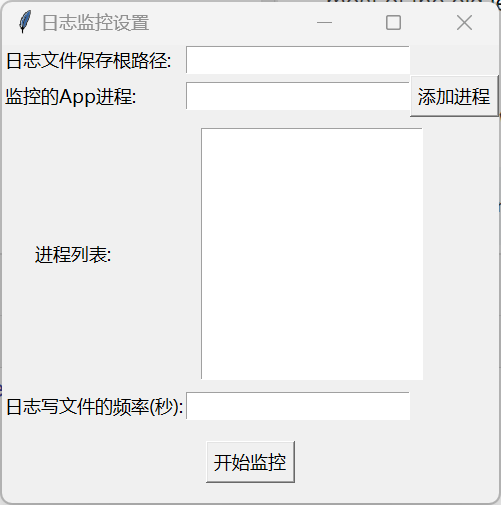

# AppRecoder

clone自仓库[pywinauto_recorder](https://github.com/beuaaa/pywinauto_recorder)，修复若干小bug，移除重放操作模块，添加日志筛选记录功能（依据进程id）

## 功能

对用户输入的进程列表中的进程进行监控，将行为筛选分别写入对应的本地文件，可以支持大部分windows平台开发的app：“MFC, VB6, VCL, simple WinForms controls and most of the old legacy apps, WinForms, WPF, Store apps, Qt, browsers.”

## 安装环境依赖

```bash
pip install -r requirements.txt
```

## 使用

运行后首先是一个初始化窗口



**Tip**: 请输入进程的完整名称，例如“Wireshark.exe”

输入完数据，点击开始监控按钮则开始监控

可以查看app的行为日志文件，日志的格式自行理解